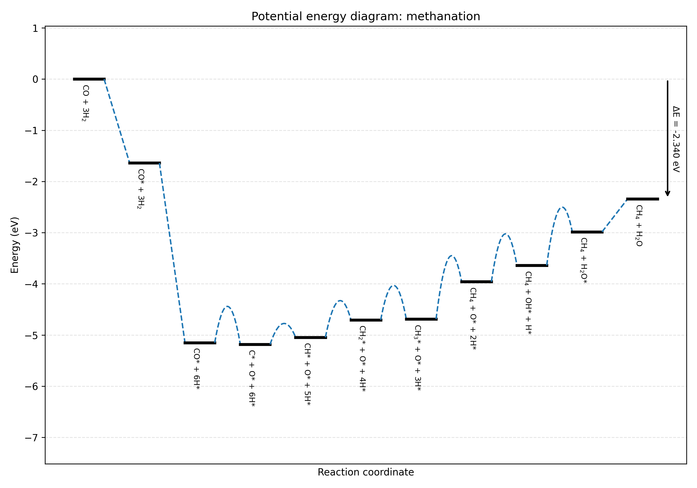

Tutorials
=========

Converting OUTCAR to YAML file
##############################

This tutorial explains how one can parse a single VASP frequency calculation and
constructs a single :code:`.yaml`-based data entry from this calculation.

Prerequisites
-------------

First, we need to prepare an :code:`OUTCAR` file that we wish to parse. Several
example :code:`OUTCAR` are stored in :code:`tests/data` which we can unpack. For
this tutorial, we assume that we are working under :code:`examples/individual`.

Go to this folder

.. code-block:: bash

   cd examples/individual

and run

.. code-block:: bash

   unzip ../../tests/data/OUTCAR_Ru1121_CH.zip

This should give the following output::

   Archive:  ../../tests/data/OUTCAR_Ru1121_CH.zip
      inflating: OUTCAR_Ru1121_CH

Building YAML files
-------------------

The :code:`OUTCAR_Ru1121_CH` file contains a frequency calculation of a CH
molecule adsorbed on a Ru(11-21) surface. To build the :code:`yaml` file, we run

.. code-block:: python

   pymkmkit freq2yaml OUTCAR_Ru1121_CH -o ru1121_c.yaml --average-pairs

The option :code:`--average-pairs` is needed in this case because the
:code:`OUTCAR` file contains a metallic slab on which CH has been adsorbed on
both sides. Thus, when sampling the frequencies for a single CH adsorbate, we
need to average out the frequencies of both the top and bottom CH fragment.

.. note::

   The ``--average-pairs`` option is required for some older slab calculations.
   Historically, adsorbates were placed on **both sides of a metal slab** to
   cancel dipole moments before dipole corrections became standard in VASP.
   Modern calculations typically use dipole corrections instead and only place
   the adsorbate on one side.

   In these legacy setups, two identical adsorbates (top and bottom) produce
   duplicate vibrational modes. Because frequencies are computed using a
   finite-difference approach, small numerical differences appear between the
   paired modes. Averaging the pairs recovers the vibrational frequencies
   corresponding to a single adsorbate while reducing numerical noise.

.. tip::

   To visualize the frequency calculation and inspect vibrational modes, you can
   use `Atom Architect <https://github.com/ifilot/atom-architect>`_. Visualizing
   the displacements can help identify paired modes and confirm the averaging.

Understanding the generated YAML file
-------------------------------------

The generated YAML file stores all information required to reproduce and reuse
the thermodynamic state in a microkinetic model.

Below we highlight the key sections and why they are stored.

``pymkmkit``
~~~~~~~~~~~~

Metadata describing how the file was created.

.. code-block:: yaml

   pymkmkit:
     version: 0.1.0
     generated: 2026-02-26T07:21:02Z

.. list-table::
   :widths: 30 70

   * - Field
     - Purpose
   * - ``version``
     - pymkmkit version used to generate the file
   * - ``generated``
     - Timestamp for provenance and reproducibility

This metadata ensures traceability and helps diagnose differences between datasets.

``structure``
~~~~~~~~~~~~~

Describes the atomic structure used in the calculation.

.. code-block:: yaml

   structure:
     formula: Ru48C2H2
     lattice_vectors: [...]
     coordinates_direct: [...]
     pbc: [true, true, true]

.. list-table::
   :widths: 30 70

   * - Field
     - Purpose
   * - ``formula`` / ``n_atoms``
     - Quick identification of system composition and size
   * - ``lattice_vectors``
     - Defines the periodic simulation cell
   * - ``coordinates_direct``
     - Atomic positions in fractional coordinates
   * - ``pbc``
     - Periodic boundary conditions

Storing the full structure allows the system to be reconstructed and verified.

``calculation``
~~~~~~~~~~~~~~~

Records how the calculation was performed.

.. code-block:: yaml

   calculation:
     code: VASP
     type: frequency
     incar: {...}
     potcar:
       - PAW_PBE Ru
       - PAW_PBE C
       - PAW_PBE H

.. list-table::
   :widths: 30 70

   * - Field
     - Purpose
   * - ``code`` / ``type``
     - Simulation software and calculation type
   * - ``incar``
     - Important settings affecting accuracy and results
   * - ``potcar``
     - Pseudopotentials used

These parameters are essential for reproducibility and validation.

``energy``
~~~~~~~~~~

.. code-block:: yaml

   energy:
     electronic: -433.134185

The electronic energy forms the basis for adsorption energies, reaction energies,
and activation barriers.

``vibrations``
~~~~~~~~~~~~~~

Contains vibrational data required to compute thermodynamic properties.

.. code-block:: yaml

   vibrations:
     frequencies_cm-1:
       - 2886.2
       - 714.1
     partial_hessian:
       dof_labels:
         - 49X
         - 49Y
         - 49Z
         - 50X
         - 50Y
         - 50Z
         - 51X
         - 51Y
         - 51Z
         - 52X
         - 52Y
         - 52Z
       matrix: [...]
     paired_modes_averaged: true

.. list-table::
   :widths: 30 70

   * - Field
     - Purpose
   * - ``frequencies_cm-1``
     - Vibrational modes used in partition functions
   * - ``partial_hessian``
     - Hessian submatrix for adsorbate degrees of freedom (stored for reuse)
   * - ``partial_hessian.dof_labels``
     - Maps each Hessian row/column to an *atom index* and *Cartesian direction* (e.g. ``49X``),
       i.e., which coordinates were displaced in the finite-difference frequency calculation
   * - ``paired_modes_averaged``
     - Indicates symmetric slab modes were averaged

Vibrational data enable computation of:

- zero-point energies
- entropy and heat capacity
- pre-exponential factors in rate constants

The ``dof_labels`` make the partial Hessian interpretable: they encode exactly
which atoms were perturbed and in which Cartesian direction when constructing
the finite-difference Hessian, so the stored matrix can be validated,
visualized, or reprocessed later.

.. tip::

   YAML files generated by **pymkmkit** can be visualized using
   `Atom Architect <https://github.com/ifilot/atom-architect>`_. The program can
   display structures, vibrational modes, and displaced coordinates, making it
   easier to inspect the finite-difference perturbations and verify the results.

Building ``network.yaml`` file
##################################

This section explains how to build a reaction network file, using
``examples/Ru1121/network.yaml`` as an example.

The file has four key sections:

1. ``stable_states``
2. ``transition_states``
3. ``network`` (elementary reaction steps)
4. ``paths`` (named combinations of elementary reaction steps)

Stable and transition states
----------------------------

The first two set of entries in the :code:`yaml` file correspond to the
:code:`stable_states` and :code:`transition_states`. The names are
self-explanatory. Both sections are lists of YAML references. Each entry
defines:

- ``name``: shorthand (unique) label used later in step definitions
- ``file``: relative path to the corresponding state YAML file

Examples
~~~~~~~~

For example, in ``examples/Ru1121/network.yaml`` we find:

.. code-block:: yaml

   stable_states:
     - name: CO*
       file: ISFS/co.yaml
     - name: C*
       file: ISFS/c.yaml

   transition_states:
     - name: CO_diss
       file: TS/co_diss.yaml

This defines two stable states, corresponding to CO* and C* adsorbed on the
catalytic surface whose state is defined by the ``YAML`` files
``ISFS/co.yaml`` and ``TS/co_diss.yaml``, respectively.

Defining elementary reaction steps
----------------------------------

The ``network`` section is a list of elementary steps. Each step has:

- ``name``: unique step identifier
- ``type``: ``surf`` or ``ads``
- ``reaction``: human-readable reaction string

For ``surf`` steps, energies are given through ``forward`` and ``backward``
blocks, each containing:

- ``ts``: list of transition-state terms
- ``is``: list of initial-state terms
- ``normalization``: divisor used to normalize to one adsorbate/site unit

Each ``ts`` or ``is`` term has:

- ``name``: label from ``stable_states`` or ``transition_states``
- ``stoichiometry``: multiplicative factor

For ``ads`` steps, the file uses ``is`` and ``fs`` (initial/final state) plus
``normalization``.

The ``normalization`` entry is used when calculations contain multiple
symmetry-equivalent adsorbates (e.g., adsorbates on both slab faces). Since the
computed energies and ZPE contributions correspond to the combined system,
``normalization: 2`` converts them to per-adsorbate values.

How pymkmkit evaluates barriers (including ZPE)
~~~~~~~~~~~~~~~~~~~~~~~~~~~~~~~~~~~~~~~~~~~~~~~

For a surface step direction (forward or backward), pymkmkit computes:

.. math::

   \Delta E^{\ddagger}_{\mathrm{elec}} =
   \frac{\sum_i \nu_i E_{\mathrm{elec}}(\mathrm{TS}_i) - \sum_j \nu_j E_{\mathrm{elec}}(\mathrm{IS}_j)}{N_{\mathrm{norm}}}

.. math::

   \Delta E^{\ddagger}_{\mathrm{zpe}} =
   \sum_i \nu_i E_{\mathrm{zpe}}(\mathrm{TS}_i) - \sum_j \nu_j E_{\mathrm{zpe}}(\mathrm{IS}_j)

.. math::

   \Delta E^{\ddagger}_{\mathrm{tot}} =
   \Delta E^{\ddagger}_{\mathrm{elec}} + \Delta E^{\ddagger}_{\mathrm{zpe}}

with

.. math::

   E_{\mathrm{zpe}} = \frac{1}{2} \sum_k h \nu_k

implemented from vibrational frequencies in cm\ :sup:`-1` as

.. math::

   E_{\mathrm{zpe}}\,\mathrm{(eV)} = \frac{1}{2}\sum_k \nu_k\,\times\,1.239841984\times10^{-4}

Examples
~~~~~~~~

1) CO dissociation

.. code-block:: yaml

   - name: CO dissociation
     type: surf
     reaction: CO* + * => C* + O*
     forward:
       ts:
         - name: CO_diss
           stoichiometry: 1
       is:
         - name: CO*
           stoichiometry: 1
       normalization: 2

Forward barrier equations are:

.. math::

   \Delta E^{\ddagger}_{\mathrm{elec,fwd}} =
   \frac{E_{\mathrm{elec}}(\mathrm{CO\_diss}) - E_{\mathrm{elec}}(\mathrm{CO^*})}
   {2}

.. math::

   \Delta E^{\ddagger}_{\mathrm{zpe,fwd}} =
   E_{\mathrm{zpe}}(\mathrm{CO\_diss}) - E_{\mathrm{zpe}}(\mathrm{CO^*})

.. math::

   \Delta E^{\ddagger}_{\mathrm{tot,fwd}} =
   \Delta E^{\ddagger}_{\mathrm{elec,fwd}} +
   \Delta E^{\ddagger}_{\mathrm{zpe,fwd}}

2) C hydrogenation

.. code-block:: yaml

   - name: C hydrogenation
     type: surf
     reaction: C* + H* => CH* + *
     forward:
       ts:
         - name: C_hydr
           stoichiometry: 1
         - name: empty
           stoichiometry: 1
       is:
         - name: C*
           stoichiometry: 1
         - name: H*
           stoichiometry: 1
       normalization: 2

Forward barrier equations are:

.. math::

   \Delta E^{\ddagger}_{\mathrm{elec,fwd}} =
   \frac{
   E_{\mathrm{elec}}(\mathrm{C\_hydr}) +
   E_{\mathrm{elec}}(\mathrm{empty})
   -
   E_{\mathrm{elec}}(\mathrm{C^*})
   -
   E_{\mathrm{elec}}(\mathrm{H^*})
   }
   {2}

.. math::

   \Delta E^{\ddagger}_{\mathrm{zpe,fwd}} =
   E_{\mathrm{zpe}}(\mathrm{C\_hydr}) +
   E_{\mathrm{zpe}}(\mathrm{empty})
   -
   E_{\mathrm{zpe}}(\mathrm{C^*})
   -
   E_{\mathrm{zpe}}(\mathrm{H^*})

.. math::

   \Delta E^{\ddagger}_{\mathrm{tot,fwd}} =
   \Delta E^{\ddagger}_{\mathrm{elec,fwd}} +
   \Delta E^{\ddagger}_{\mathrm{zpe,fwd}}

Grouping elementary steps into mechanisms using paths
-----------------------------------------------------

The ``paths`` section defines named sequences of network steps, for example to
evaluate overall reaction energies or to build potential energy diagrams.

Each path contains:

- ``name``: path identifier
- ``startlabel``: label shown for the initial state in PED output
- ``steps``: ordered list of elementary steps by ``name``

Optional per-step entries:

- ``factor`` (default ``1``): multiply that step contribution; this is used to
  represent successive applications of this elementary reaction step, for
  example when you want sixfold 1/2 H2 adsorption.
- ``label``: custom state label for PED annotations

Example (from the Ru(11-21) case):

.. code-block:: yaml

   paths:
     - name: methanation
       startlabel: CO + 3H2
       steps:
         - name: CO adsorption
           label: CO* + 3H2
         - name: H2 adsorption
           factor: 6
           label: CO* + 6H*

Evaluating network files
------------------------

From the repository root, you can run:

.. code-block:: bash

   pymkmkit read_network examples/Ru1121/network.yaml

This parses all states and prints step-wise quantities:

- for ``surf`` steps: forward and reverse barriers (including ZPE correction)
- for ``ads`` steps: adsorption heat (including ZPE correction)

which yields the following output::

  Reaction: CO* + * => C* + O*
    Forward barrier: 0.708003 eV (inc. ZPE-corr: -0.031787)
    Reverse barrier: 0.743850 eV (inc. ZPE-corr: -0.024853)
  Reaction: C* + H* => CH* + *
    Forward barrier: 0.406754 eV (inc. ZPE-corr: -0.047930)
    Reverse barrier: 0.267382 eV (inc. ZPE-corr: -0.139948)
  Reaction: CH* + H* => CH2* + *
    Forward barrier: 0.703780 eV (inc. ZPE-corr: -0.038874)
    Reverse barrier: 0.362366 eV (inc. ZPE-corr: -0.108891)
  Reaction: CH2* + H* => CH3* + *
    Forward barrier: 0.672479 eV (inc. ZPE-corr: 0.046713)
    Reverse barrier: 0.657561 eV (inc. ZPE-corr: -0.122669)
  Reaction: CH3* + H* => CH4 + 2*
    Forward barrier: 1.198466 eV (inc. ZPE-corr: -0.012794)
    Reverse barrier: 0.466999 eV (inc. ZPE-corr: -0.138733)
  Reaction: O* + H* => OH* + *
    Forward barrier: 0.925349 eV (inc. ZPE-corr: -0.075468)
    Reverse barrier: 0.607454 eV (inc. ZPE-corr: -0.197065)
  Reaction: OH* + H* => H2O* + *
    Forward barrier: 1.102802 eV (inc. ZPE-corr: 0.048977)
    Reverse barrier: 0.446876 eV (inc. ZPE-corr: -0.068496)
  Reaction: CO + * => CO*
    Adsorption heat: -1.638042 eV (inc. ZPE-corr: 0.021169)
  Reaction: H2 + 2* => 2H*
    Adsorption heat: -0.585109 eV (inc. ZPE-corr: 0.030218)
  Reaction: H2O + * => H2O*
    Adsorption heat: -0.643202 eV (inc. ZPE-corr: 0.059390)

To evaluate total energies of all named paths:

.. code-block:: bash

   pymkmkit evaluate_paths examples/Ru1121/network.yaml

This sums the (factor-weighted) step reaction heats for each path as given
by the following output::

  Path methanation: -2.340352 eV

To construct a potential energy diagram for one path:

.. code-block:: bash

   pymkmkit build_ped examples/Ru1121/network.yaml methanation methanation.png

This builds the PED of the ``methanation`` path and writes it to
``methanation.png``.

